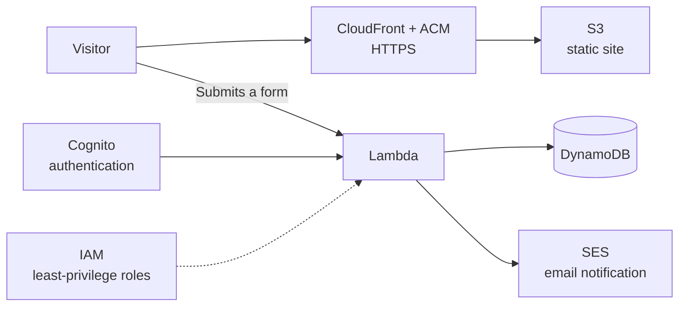

# Hi, I'm Jay 👋

### Identity & Access Security · Sydney, Australia

Most breaches don't start with clever hacking. They start with someone logging in. A reused password, a skipped MFA prompt, a convincing "I'm locked out, can you reset me?" request. **That's the problem I care about: making sure the right people get in, and everyone else doesn't.**

I work on this every day as an **IT Support Specialist at Zencyber**, managing Microsoft Entra ID and Microsoft 365 identities for small business clients. That means enforcing MFA, handling Conditional Access and SSO issues, running joiners and leavers cleanly, and verifying every reset request before I touch an account. I watch sign-in and device activity in **Microsoft Sentinel and Defender**, and escalate anything suspicious with clear evidence.

I bring the same mindset to what I build. On the AWS platform I've delivered for an NDIS provider, I use **Cognito** for authentication and **IAM** to give each service only the access it needs, because the same principles apply whether you're protecting staff accounts or a Lambda function.

**Specialising in:** Microsoft Entra ID · MFA & Conditional Access · Least-privilege access · Cloud identity (AWS IAM & Cognito) · Sign-in threat monitoring

**Backed by:** SC-200 · PCNSA · CCNA · Network+ · Master of IT (Network & Information Security)

---

## 🔭 Right now

- 📱 Building **EmuShifts**, an iOS shift management app for an NDIS provider
- 🛡️ Running a **home SOC lab on Elastic Security**, simulating attacks and writing detection rules
- 🧩 Maintaining **[Clean Link Copier](https://github.com/vipercipher/clean-link-copier)**, my privacy-focused Chrome extension
- 🌐 Looking after the websites, domains and email for two NDIS providers
<!-- 📚 Studying for SC-300 (Identity and Access Administrator)   ← uncomment only if true -->

---

## 🌐 Client work: delivered end to end

I've designed, built and look after the online presence of two NDIS disability support providers. Having also worked in IT support at a disability organisation, I know how much these businesses depend on technology that's simple, accessible and trustworthy, for both their staff and the people they support.

For both clients I handled everything from the first logo sketch to the last DNS record.

### [Emuability](https://www.emuability.com.au): registered NDIS provider, NSW

- **Branding & design:** logo, visual identity and every graphic on the site
- **Serverless AWS build**, hosted in the Sydney region (ap-southeast-2) so client data stays in Australia:
  - **S3 + CloudFront** for fast, reliable hosting and delivery
  - **AWS Certificate Manager (ACM)** for HTTPS across the site
  - **Lambda** to process referral, booking, feedback and contact forms
  - **DynamoDB** to store form submissions
  - **Amazon SES** to send email notifications when a new form comes in
  - **Cognito** for secure authentication
  - **IAM** roles and policies so each service only has the permissions it needs
- **Accessibility built in:** adjustable text size, high-contrast mode and reduced motion, plus an accessibility statement and privacy policy
- **Domain, DNS & email:** GoDaddy, with business email through Microsoft 365 admin

> "Jay built Emuability's entire online presence from scratch: our logo and branding, a secure and accessible website, business email and domain setup. He's now building EmuShifts, our own shift management app, so our team can post, claim and approve shifts in one place. As an NDIS provider, we handle sensitive information, and Jay makes security and privacy a priority in everything he builds. He's reliable, explains technical decisions clearly, and is always quick to help. I'd happily recommend him."
>
> — **Suni**, Director, [Emuability](https://www.emuability.com.au)

### 🚧 EmuShifts: shift management app for Emuability *(in development)*

A native iOS app that replaces phone-call-and-text rostering with a simple workflow: managers post vacant shifts, support workers get notified and request them, and managers approve.

- **iOS app** built in Swift/SwiftUI
- **Serverless backend:** API Gateway + Lambda, with **Cognito** for staff sign-in
- **Push notifications** when new shifts are posted and when claims are approved or declined
- **Manager approval workflow:** `open → requested → approved / declined`, so no one assumes a shift is theirs until it's confirmed
- **Designed with NDIS requirements in mind:** audit trail of shift changes, workers only see the participant details they need for their shift, and planned checks on NDIS Worker Screening status before a shift can be claimed
- **Planned:** approved shift hours sent automatically to the payroll system, so timesheets never need re-entering

### [MercyLight](https://www.mercylight.com.au): NDIS disability services provider

- **Branding & design:** logo, visual design and all site assets
- **Build:** Squarespace, so the team can update content themselves without a developer
- **Domain, DNS & email:** GoDaddy, with business email through Microsoft 365 admin

---

## 🛠 Tools I've built

Small, focused browser tools that fix everyday annoyances. They're privacy-friendly and run entirely in your browser.

### [Clean Link Copier](https://github.com/vipercipher/clean-link-copier)
A Chrome extension that strips tracking parameters (utm_*, fbclid, gclid and others) from links before you share them. People pass on links every day that quietly carry data about where they came from. This removes it in one click. Collects no data, and handles edge cases like browser-internal pages gracefully.

### [YouTube Auto Skip](https://github.com/vipercipher/yt-auto-skip)
A Chrome, Edge and Brave extension that clicks YouTube's **Skip Ad** button the moment it appears, usually within half a second, so you never have to reach for the mouse. It also closes the small banner ads that pop up over videos.

- Uses a `MutationObserver` to react instantly when the player changes, with a lightweight polling fallback
- Popup with an on/off switch and a counter of how many ads it has skipped
- Doesn't block ads or interfere with YouTube, it just clicks the Skip button you'd click yourself
- No data leaves your browser, and the only permission it uses is local storage for your settings

---

## 🔐 Security projects & labs

I learn best by doing, so most of what I study ends up as a hands-on lab.

| Project | What I did |
|---|---|
| **Home SOC Lab (Elastic Security)** | Deployed Elastic Defend on a Windows VM, ran simulated attacks, investigated the alerts they triggered and wrote my own detection rules |
| **[Threat Modeling (Capstone)](https://github.com/vipercipher/ThreatModelingProject)** | Mapped a system's attack surface, identified likely threats and proposed mitigations |
| **[SQL Injection with Burp Suite](https://github.com/vipercipher/SQLiVuln)** | Found and exploited SQL injection in a lab environment and documented how to prevent it |
| **[Network Enumeration with Nmap](https://github.com/vipercipher/NetworkEnumerationNMAP)** | Host discovery, port scanning and service enumeration |
| **EC-Council CyberQ Lab** | Hands-on vulnerability assessment |

---

## 🎓 Certifications & education

<!-- Turn each certification name into a verification link when you have them, e.g. [Security Operations Analyst Associate (SC-200)](https://www.credly.com/badges/...) -->

| Certification | Issuer |
|---|---|
| **Security Operations Analyst Associate (SC-200)** | Microsoft |
| **Certified Network Security Administrator (PCNSA)** | Palo Alto Networks |
| **Certified Network Associate (CCNA)** | Cisco |
| **Network+** | CompTIA |
| **Certified Cybersecurity Technician (CCT)** | EC-Council |
| **Cyber Security Threat Assessment and Risk Management** | IAT-Digital (NSW Government) |

🎓 **Master of Information Technology (Network and Information Security)**

---

## 🧰 Skills & tools

| Area | Tools & skills |
|---|---|
| **Identity & access** | Microsoft Entra ID, MFA, SSO, Conditional Access, Intune, AWS IAM, AWS Cognito |
| **Security operations** | Microsoft Sentinel, Microsoft Defender, Elastic Security, alert triage, detection rules, MITRE ATT&CK |
| **Offensive security** | Burp Suite, Nmap, vulnerability assessment, threat modeling |
| **Cloud** | AWS (S3, CloudFront, ACM, Lambda, API Gateway, DynamoDB, SES), Azure VMs |
| **Networking** | TCP/IP, DNS, DHCP, VLANs, VPN, routing & switching, Palo Alto firewalls |
| **IT administration** | Microsoft 365 admin, Exchange Online, DNS management (GoDaddy) |
| **App & web development** | Swift/SwiftUI, HTML/CSS, JavaScript, Squarespace, web accessibility |
| **Design** | Logo design, branding, UI design |
| **Systems & workflow** | Windows, Windows Server, Linux, VMware, EVE-NG, Git, GitHub |

---

## 🤝 Let's connect

I'm always happy to talk identity security, swap lab ideas, or help a small business get its tech set up properly. I'm open to opportunities in **identity & access management, security operations and cloud security**.

[LinkedIn](https://linkedin.com/in/jayshrestha55)

---
All offensive security testing shown here was performed in authorized lab environments. No client data or credentials are published in any of my repositories.
