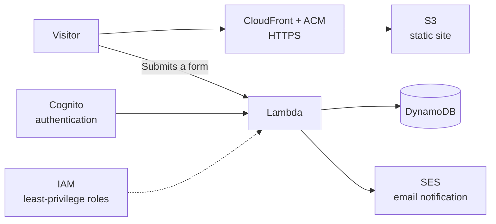

# Hi, I'm Jay 👋

I'm an IT Support Specialist at **Zencyber**, where I look after identity security for small businesses: MFA, Conditional Access, safe account resets, and watching sign-ins in Sentinel and Defender.

Outside that, I build. I've delivered secure, accessible websites on AWS for two NDIS providers, I'm building an iOS rostering app for one of them, and I make small privacy-friendly tools. I practise detection in a home SOC lab.

Whatever I'm working on, I try to keep it secure, simple and easy for people to use.

---

## 🔭 Right now

- 📱 Building **EmuShifts**, an iOS shift management app for an NDIS provider
- 🛡️ Running a **home SOC lab on Elastic Security**, simulating attacks and writing detection rules
- 🧩 Maintaining two privacy-friendly browser extensions: **[Clean Link Copier](https://github.com/vipercipher/clean-link-copier)** and **[YouTube Auto Skip](https://github.com/vipercipher/yt-auto-skip)**
- 🌐 Looking after the websites, domains and email for two NDIS providers
<!-- 📚 Studying for SC-300 (Identity and Access Administrator)   ← uncomment only if true -->

---

## 🌐 Client work: delivered end to end

I've designed, built and look after the online presence of two NDIS disability support providers. Having also worked in IT support at a disability organisation, I know how much these businesses depend on technology that's simple, accessible and trustworthy, for both their staff and the people they support.

For both clients I handled everything from the first logo sketch to the last DNS record.

### [Emuability](https://www.emuability.com.au): registered NDIS provider, NSW

- **Branding & design:** logo, visual identity and every graphic on the site
- **Serverless AWS build**, hosted in the Sydney region (ap-southeast-2) so client data stays in Australia:
  - **S3 + CloudFront** for fast, reliable hosting and delivery
  - **AWS Certificate Manager (ACM)** for HTTPS across the site
  - **Lambda** to process referral, booking, feedback and contact forms
  - **DynamoDB** to store form submissions
  - **Amazon SES** to send email notifications when a new form comes in
  - **Cognito** for secure authentication
  - **IAM** roles and policies so each service only has the permissions it needs
- **Accessibility built in:** adjustable text size, high-contrast mode and reduced motion, plus an accessibility statement and privacy policy
- **Domain, DNS & email:** GoDaddy, with business email through Microsoft 365 admin

```mermaid
flowchart LR
    V[Visitor] --> CF[CloudFront + ACM<br/>HTTPS]
    CF --> S3[S3<br/>static site]
    V -->|Submits a form| L[Lambda]
    L --> DB[(DynamoDB)]
    L --> SES[SES<br/>email notification]
    COG[Cognito<br/>authentication] --> L
    IAM[IAM<br/>least-privilege roles] -.-> L
```

> "Jay built Emuability's entire online presence from scratch: our logo and branding, a secure and accessible website, business email and domain setup. He's now building EmuShifts, our own shift management app, so our team can post, claim and approve shifts in one place. As an NDIS provider, we handle sensitive information, and Jay makes security and privacy a priority in everything he builds. He's reliable, explains technical decisions clearly, and is always quick to help. I'd happily recommend him."
>
> — **Suni**, Director, [Emuability](https://www.emuability.com.au)

### 🚧 EmuShifts: shift management app for Emuability *(in development)*

A native iOS app that replaces phone-call-and-text rostering with a simple workflow: managers post vacant shifts, support workers get notified and request them, and managers approve.

- **iOS app** built in Swift/SwiftUI
- **Serverless backend:** API Gateway + Lambda, with **Cognito** for staff sign-in
- **Push notifications** when new shifts are posted and when claims are approved or declined
- **Manager approval workflow:** `open → requested → approved / declined`, so no one assumes a shift is theirs until it's confirmed
- **Designed with NDIS requirements in mind:** audit trail of shift changes, workers only see the participant details they need for their shift, and planned checks on NDIS Worker Screening status before a shift can be claimed
- **Planned:** approved shift hours sent automatically to the payroll system, so timesheets never need re-entering

### [MercyLight](https://www.mercylight.com.au): NDIS disability services provider

- **Branding & design:** logo, visual design and all site assets
- **Build:** Squarespace, so the team can update content themselves without a developer
- **Domain, DNS & email:** GoDaddy, with business email through Microsoft 365 admin

---

### 🔎 Search visibility (SEO)

I set websites up so small businesses can be found by the people looking for them:

- **Technical SEO:** fast-loading pages, mobile-friendly design, clean page titles and meta descriptions, and a sitemap so Google can find every page
- **Local search:** Google Business Profile setup so the business shows up in local searches and on Google Maps
- **Google Search Console:** connecting the site to Google, submitting pages for indexing, and monitoring how people find it
- **Accessible, well-structured content:** clear headings and descriptive text help both search engines and people using screen readers

Rankings depend on competition and time, so I focus on doing the fundamentals properly and tracking real results rather than promising a position.

## 🛠 Tools I've built

Small, focused browser tools that fix everyday annoyances. They're privacy-friendly and run entirely in your browser.

### [Clean Link Copier](https://github.com/vipercipher/clean-link-copier)
A Chrome extension that strips tracking parameters (utm_*, fbclid, gclid and others) from links before you share them. People pass on links every day that quietly carry data about where they came from. This removes it in one click. Collects no data, and handles edge cases like browser-internal pages gracefully.

### [YouTube Auto Skip](https://github.com/vipercipher/yt-auto-skip)
A Chrome, Edge and Brave extension that clicks YouTube's **Skip Ad** button the moment it appears, usually within half a second, so you never have to reach for the mouse. It also closes the small banner ads that pop up over videos.

- Uses a `MutationObserver` to react instantly when the player changes, with a lightweight polling fallback
- Popup with an on/off switch and a counter of how many ads it has skipped
- Doesn't block ads or interfere with YouTube, it just clicks the Skip button you'd click yourself
- No data leaves your browser, and the only permission it uses is local storage for your settings

### [RentRise.au](https://rentrise.au) · [repo](https://github.com/vipercipher/rentrise)
A free website that checks whether an Australian rent increase follows the law. Renters answer a few questions from their notice and get a clear verdict, the earliest date the new rent can legally start, their tribunal deadline, and a ready-to-send message for their agent. I built it because rent increase rules differ by state, change often, and most online advice contradicts itself.

- **Queensland and NSW checkers** built from official sources (RTA, NSW Fair Trading, Tenants' Union of NSW), with plain-English rules guides
- **Privacy by design:** all calculations run in the browser, so nothing renters enter is sent anywhere. Self-hosted fonts, no ads or tracking cookies
- **Hardened like production:** strict Content Security Policy, HSTS and other security headers, and an hCaptcha-protected contact form that only loads when used
- **Deployed on Cloudflare Pages** with custom domain, DNS, email routing and cookie-free analytics, plus Google Search Console and structured data for search visibility

---

## 🔐 Security projects & labs

I learn best by doing, so most of what I study ends up as a hands-on lab.

| Project | What I did |
|---|---|
| **[Home SOC Lab (Elastic Security)](https://github.com/vipercipher/soc-lab-beginner)** | Deployed Elastic Defend on a Windows VM, ran simulated attacks, investigated the alerts they triggered and wrote my own detection rules |
| **[Threat Modeling (Capstone)](https://github.com/vipercipher/ThreatModelingProject)** | Mapped a system's attack surface, identified likely threats and proposed mitigations |
| **[SQL Injection with Burp Suite](https://github.com/vipercipher/SQLiVuln)** | Found and exploited SQL injection in a lab environment and documented how to prevent it |
| **[Network Enumeration with Nmap](https://github.com/vipercipher/NetworkEnumerationNMAP)** | Host discovery, port scanning and service enumeration |
| **EC-Council CyberQ Lab** | Hands-on vulnerability assessment |

---

## 🎓 Certifications & education

<!-- Turn each certification name into a verification link when you have them, e.g. [Security Operations Analyst Associate (SC-200)](https://www.credly.com/badges/...) -->

| Certification | Issuer |
|---|---|
| **Security Operations Analyst Associate (SC-200)** | Microsoft |
| **Certified Network Security Administrator (PCNSA)** | Palo Alto Networks |
| **Certified Network Associate (CCNA)** | Cisco |
| **Network+** | CompTIA |
| **Certified Cybersecurity Technician (CCT)** | EC-Council |
| **Cyber Security Threat Assessment and Risk Management** | IAT-Digital (NSW Government) |

🎓 **Master of Information Technology (Network and Information Security)**

---

## 🧰 Skills & tools

| Area | Tools & skills |
|---|---|
| **Identity & access** | Microsoft Entra ID, MFA, SSO, Conditional Access, Intune, AWS IAM, AWS Cognito |
| **Security operations** | Microsoft Sentinel, Microsoft Defender, Elastic Security, alert triage, detection rules, MITRE ATT&CK, Wireshark |
| **Frameworks (familiar)** | NIST Cybersecurity Framework, Essential Eight (ACSC), MITRE ATT&CK, OSINT |
| **Offensive security** | Burp Suite, Nmap, vulnerability assessment, OWASP threat modeling & Top 10 |
| **Cloud** | AWS (S3, CloudFront, ACM, Lambda, API Gateway, DynamoDB, SES), Azure VMs, Cloudflare (Pages, DNS, Email Routing, Web Analytics) |
| **Networking** | TCP/IP, DNS, DHCP, VLANs, VPN, routing & switching, Palo Alto firewalls |
| **IT administration** | Microsoft 365 admin, Exchange Online, DNS management (GoDaddy) |
| **App & web development** | Swift/SwiftUI, HTML/CSS, JavaScript, Squarespace, web accessibility |
| **Design** | Logo design, branding, UI design |
| **Systems & workflow** | Windows, Windows Server, Linux, VMware, EVE-NG, Git, GitHub |

---

## 🤝 Let's Connect & Grow Together

I'm always happy to talk identity security, swap lab ideas, or help a small business get its tech set up properly. I'm open to opportunities in **identity & access management, security operations and cloud security**.

[LinkedIn](https://linkedin.com/in/jayshrestha55)

---
All offensive security testing shown here was performed in authorized lab environments. No client data or credentials are published in any of my repositories.
